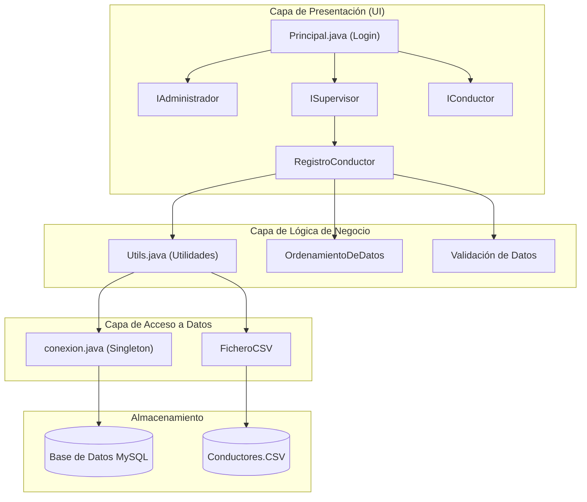
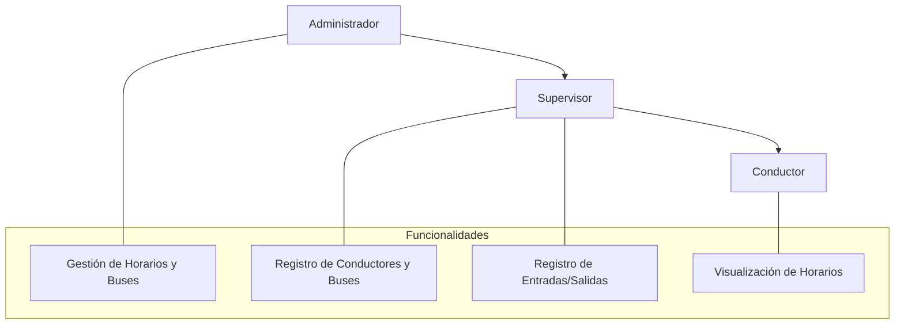

---

# Sistema de Movimiento de Buses (Java Swing)

Un sistema de gestión de flotas de autobuses desarrollado en Java con una interfaz gráfica de usuario (GUI) construida con Swing. La aplicación está diseñada para optimizar las operaciones de transporte, ofreciendo acceso basado en roles para administradores, supervisores y conductores.

[](https://www.java.com)
[](https://docs.oracle.com/javase/tutorial/uiswing/)
[](https://www.mysql.com/)
[](https://opensource.org/licenses/MIT)

---

## Índice

- [Características Principales](#características-principales)
- [Arquitectura del Sistema](#arquitectura-del-sistema)
- [Stack Tecnológico](#stack-tecnológico)
- [Guía de Inicio Rápido](#guía-de-inicio-rápido)
  - [Prerrequisitos](#prerrequisitos)
  - [Configuración](#configuración)
- [Funcionalidades por Rol](#funcionalidades-por-rol)
- [Contribuciones](#contribuciones)
- [Licencia](#licencia)

---

## Características Principales

- **Acceso Basado en Roles:** Interfaces y permisos personalizados para Administradores, Supervisores y Conductores.
- **Gestión de Conductores (CRUD):** Funcionalidad completa para registrar, modificar, eliminar y listar conductores.
- **Seguimiento de Operaciones:** Registro y monitoreo de entradas y salidas de autobuses.
- **Gestión de Horarios:** Herramientas para administrar los horarios y rutas de la flota.
- **Estrategia de Almacenamiento Dual:** El sistema puede operar con una base de datos **MySQL** o, en su defecto, con archivos **CSV** como respaldo, garantizando la operatividad incluso sin conexión a la base de datos.
- **Interfaz Personalizable:** Un sistema de temas integrado que permite cambiar entre **modo claro y oscuro** en tiempo real en todas las ventanas.
- **Algoritmos de Ordenamiento:** Múltiples algoritmos (QuickSort, MergeSort, BubbleSort, etc.) para organizar los datos de los conductores según diferentes criterios.

---

## Arquitectura del Sistema

La aplicación sigue una arquitectura de varias capas que separa la presentación, la lógica de negocio y el acceso a datos. La autenticación dirige a los usuarios a la interfaz correspondiente a su rol, y un sistema de utilidades centralizado gestiona las operaciones comunes.



---

## Stack Tecnológico

| Componente | Tecnología | Propósito |
| :--- | :--- | :--- |
| **Lenguaje** | Java | Lenguaje de programación principal |
| **Framework de GUI**| Java Swing | Creación de la interfaz gráfica de usuario de escritorio |
| **Base de Datos** | MySQL | Almacenamiento primario de datos relacionales |
| **Almacenamiento de Respaldo**| Archivos CSV | Persistencia de datos en modo offline |
| **Conectividad DB**| JDBC | Conexión y ejecución de consultas a la base de datos |

---

## Guía de Inicio Rápido

### Prerrequisitos

- **JDK 17** o superior.
- Un servidor de **MySQL** en funcionamiento.
- Un IDE de Java como **NetBeans** o **IntelliJ IDEA** (el proyecto está configurado para NetBeans).

### Configuración

1.  **Clona el repositorio:**
    ```bash
    git clone https://github.com/OAQR/Movimiento-de-Buses.git
    ```

2.  **Configura la base de datos:**
    -   Ejecuta el script `Script DB.sql` en tu servidor MySQL para crear la base de datos `movimiento_buses_db` y sus tablas.
    -   El script también inserta usuarios de prueba para cada rol (`A000001`, `S000001`, `C000001`).

3.  **Configura la conexión:**
    -   Abre el archivo `src/com/project/MySQL/conexion.java`.
    -   Modifica las credenciales de conexión (`URL`, `USERNAME`, `PASSWORD`) para que coincidan con la configuración de tu servidor MySQL.

4.  **Ejecuta la aplicación:**
    -   Abre el proyecto en tu IDE.
    -   Ejecuta el archivo `src/com/project/Interfaces/Principal.java`.
    -   Se abrirá la ventana de inicio de sesión.

---

## Funcionalidades por Rol

El sistema proporciona tres niveles de acceso diferentes:



- **Administrador:** Tiene control total sobre el sistema, incluyendo la gestión de horarios y la flota de autobuses.
- **Supervisor:** Gestiona las operaciones diarias, como el registro de nuevos conductores, la asignación de autobuses y el seguimiento de sus movimientos.
- **Conductor:** Tiene acceso de solo lectura a la información relevante para su trabajo, como sus horarios asignados.

---

## Contribuciones

Este es un proyecto de portafolio personal y actualmente no se aceptan contribuciones externas. Sin embargo, si encuentras algún error o tienes alguna sugerencia, no dudes en abrir un *Issue* en el repositorio.

---

## Licencia

Este proyecto está distribuido bajo la Licencia MIT. Consulta el archivo `LICENSE` para más detalles.
